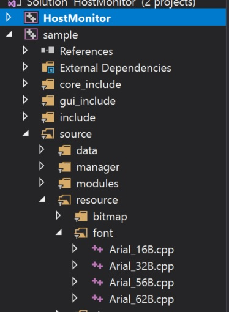

# GuiLite Toolkit - Build Font/Bitmap resource
GuiLiteToolkit is 200 lines code for building font lattice of [GuiLite](https://github.com/idea4good/GuiLite)
It works with unicode, will help your APP support all languages and symbols over the world.

## How to use it?
Step 1: Input the charaters you need.

Step 2: Choose font type you want.

Step 3: Generate CPP files.

Step 4: Add CPP files to your APP project.

## How to input charaters in your APP?
### For Linux - input unicode charaters directly
e.g char* my_string = "abc你好"
### For Windows Visual studio
 - For ascii code: input directly.
 - For 2 bytes code or above, input charaters in code: 
 e.g: char* my_string = "abc你好" => char* my_string = "abc\xE4\xBD\xA0\xE5\xA5\xBD"

 ## Sample code
 [GuiLite Samples](https://github.com/idea4good/GuiLiteSamples/blob/master/HostMonitor/SampleCode/source/ui_tree/Dialog/patient_setup/patient_setup_dlg_xml.cpp)